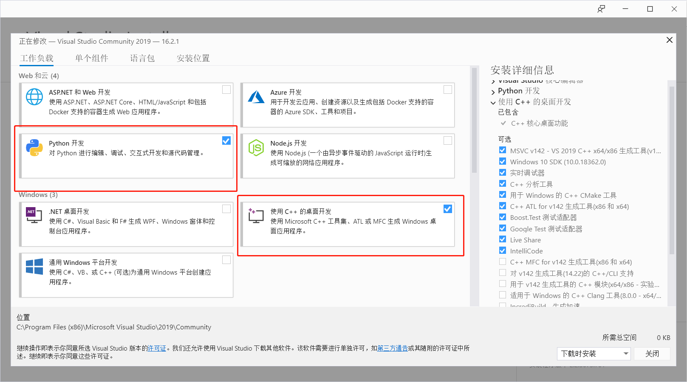
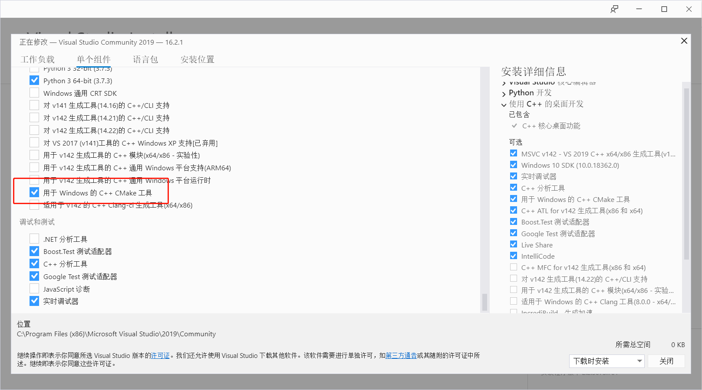

### face_unlock

    使用人脸处理库Dlib完成的一个屏幕解锁小demo

### 环境

    python3、OpenCv、dlib、CMake

pip安装CV2太慢？（从清华的镜像去安装opencv库）

    pip3 install -i https://pypi.tuna.tsinghua.edu.cn/simple opencv-python

利用Visual Studio 2019安装环境

### Steps

    人脸信息采集录入 -> 录入人脸数据存入features_all.csv -> 启动face_unlock2.py

### 截图

